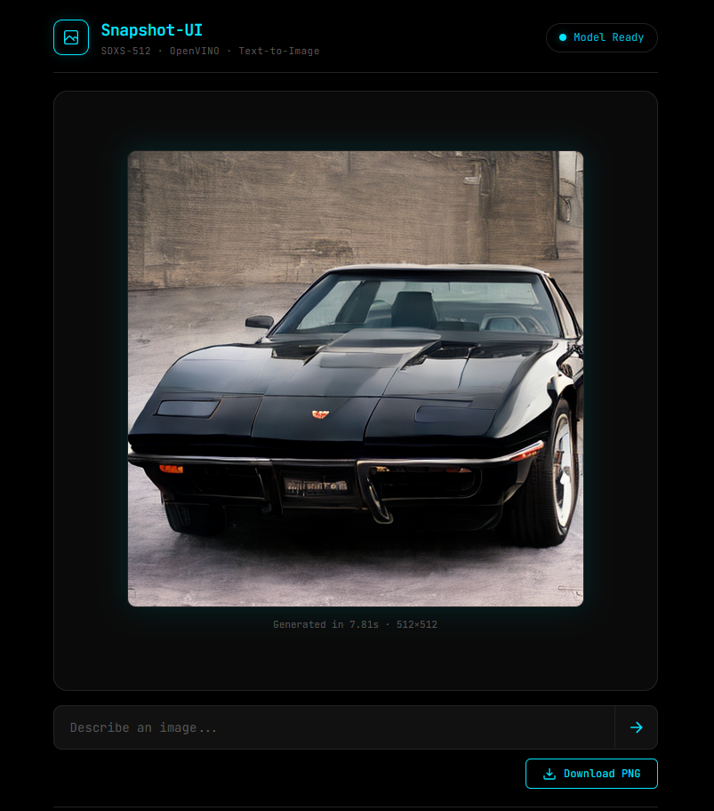

# Snapshot-UI-LLM-Chat



A self-contained Docker application that runs the [SDXS-512-0.9-OpenVINO](https://huggingface.co/rupeshs/sdxs-512-0.9-openvino) text-to-image model.

---

## System Requirements

> **Minimum: 8 GB RAM | Recommended: 16 GB RAM or more**

The model loads entirely into memory on your CPU. With 8 GB your system may feel sluggish; with 16 GB or more everything runs smoothly. If you're using a virtual machine, make sure to allocate at least 8 GB of RAM.

---

## Installing Docker (Ubuntu / Kali)

If Docker is not already installed:

```bash
sudo apt update
sudo apt install -y docker.io docker-compose
sudo usermod -aG docker $USER
```

Log out and back in for the group change to take effect, then verify:

```bash
docker --version
```

---

## How Much Data Will This Download?

When you run `./setup.sh`, the model (~500 MB) is automatically downloaded from Hugging Face during the Docker build and baked directly into the image. This means:

- No internet connection is needed after the build
- The container starts quickly (model is already on disk)
- Generation runs fully **offline** at runtime

---

## Quick Start

### 1. Clone the repository

```bash
git clone https://github.com/androidteacher/Snapshot-UI-Text-To-Image-LLM-Docker.git
cd Snapshot-UI-Text-To-Image-LLM-Docker
```

### 2. Build and run

```bash
chmod +x setup.sh stop_snapshot.sh delete_snapshot.sh
./setup.sh
```

> ⚠️ Expect **5–15 minutes** on the first build. The container is **automatically started** when the build finishes.

> **Note:** The progress bar may appear frozen during the model download — this is normal. The display <span style="color:cyan">**MAY NOT**</span> accurately reflect what is being downloaded.
>
> ```
> #11 22.14 [1/2] Downloading model from HuggingFace...
> Fetching 20 files:   5%|▌         | 1/20 [00:00<00:05,  3.53it/s]
> ```
>
> **Be patient!** The build is still running. It will resume output once the large model files finish downloading.

### 3. Open the UI and start generating!

Open your browser and navigate to:

```
http://localhost:9999
```

Wait a few seconds for the status indicator to show **"Model Ready"**, then type any prompt and hit **Enter** (or click →).

**Example prompts to try:**
- `A cute cat sitting on a windowsill`
- `A sunset over misty mountains`
- `A cyberpunk city at night with neon lights`
- `A watercolor painting of a lighthouse`

---

## Managing the Container

| Action                    | Command                  |
| ------------------------- | ------------------------ |
| **Stop** the container    | `./stop_snapshot.sh`     |
| **Restart** the container | `docker start snapshot-ui` |
| **Rebuild** from scratch  | `./setup.sh`             |
| **Delete everything**     | `./delete_snapshot.sh`   |
| View logs                 | `docker logs -f snapshot-ui` |

- **`stop_snapshot.sh`** — Gracefully stops the running container. You can restart it later with `docker start snapshot-ui`.
- **`delete_snapshot.sh`** — Completely removes the container, Docker image, dangling volumes, and build cache. You will need to run `./setup.sh` again to reinstall.

---

## Credits

- **Model:** [SDXS-512-0.9](https://huggingface.co/IDKiro/sdxs-512-0.9) by IDKiro, OpenVINO conversion by [rupeshs](https://huggingface.co/rupeshs/sdxs-512-0.9-openvino)
- **Runtime:** [Intel OpenVINO](https://docs.openvino.ai/) + [Optimum Intel](https://huggingface.co/docs/optimum/intel/index)
- **Backend:** [FastAPI](https://fastapi.tiangolo.com/) + [Uvicorn](https://www.uvicorn.org/)
